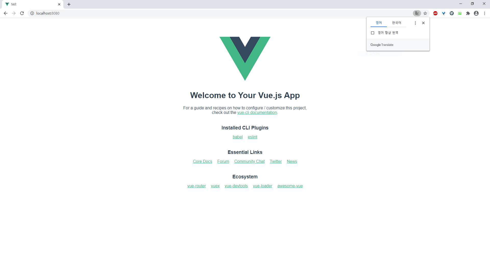
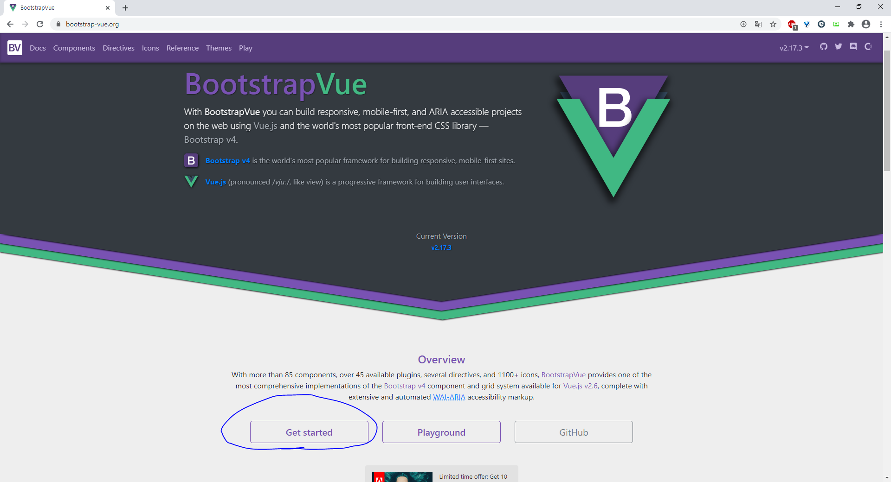
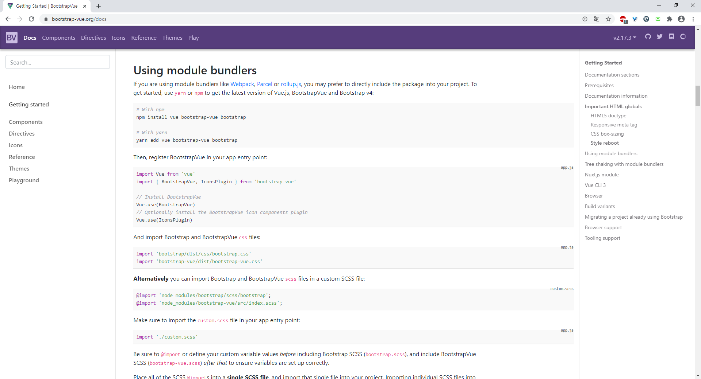
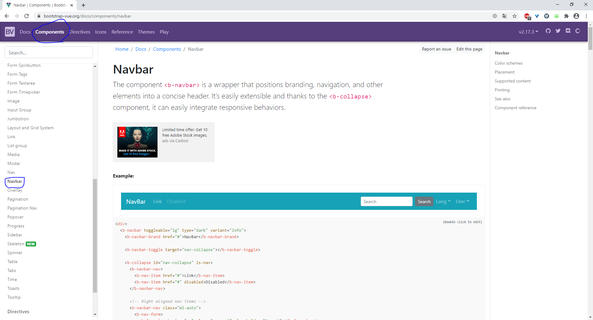

# vue.js

## 기본 생성

> ```
> npm install -g @vue/cli
> 
> vue create test
> ```
>
> 그후 default 선택
>
> ```
> cd test
> 
> npm run serve
> ```
>
> 
>
> 이런 화면 생성

## vue router 설치

> ```
> npm install vue-router --save
> ```

components 아래에 layout폴더 생성

layout폴더에 Header.vue생성

> 

https://bootstrap-vue.org/  들어가서



get started 클릭

Using module bundlers에서 

``` 
npm install vue bootstrap-vue bootstrap
```


Using module bundlers에서



main.js에 아래 코드추가

> ```
> import { BootstrapVue, IconsPlugin } from 'bootstrap-vue'
> 
> // Install BootstrapVue
> Vue.use(BootstrapVue)
> // Optionally install the BootstrapVue icon components plugin
> Vue.use(IconsPlugin)
> ```
>
> ```
> import 'bootstrap/dist/css/bootstrap.css'
> import 'bootstrap-vue/dist/bootstrap-vue.css'
> ```




Components에서 navbar로가서 아래코드 복사하고 Header.vue파일에는

```
<div>
  <b-navbar toggleable="lg" type="dark" variant="info">
    <b-navbar-brand href="#">NavBar</b-navbar-brand>

    <b-navbar-toggle target="nav-collapse"></b-navbar-toggle>

    <b-collapse id="nav-collapse" is-nav>
      <b-navbar-nav>
        <b-nav-item href="#">Link</b-nav-item>
        <b-nav-item href="#" disabled>Disabled</b-nav-item>
      </b-navbar-nav>

      <!-- Right aligned nav items -->
      <b-navbar-nav class="ml-auto">
        <b-nav-form>
          <b-form-input size="sm" class="mr-sm-2" placeholder="Search"></b-form-input>
          <b-button size="sm" class="my-2 my-sm-0" type="submit">Search</b-button>
        </b-nav-form>

        <b-nav-item-dropdown text="Lang" right>
          <b-dropdown-item href="#">EN</b-dropdown-item>
          <b-dropdown-item href="#">ES</b-dropdown-item>
          <b-dropdown-item href="#">RU</b-dropdown-item>
          <b-dropdown-item href="#">FA</b-dropdown-item>
        </b-nav-item-dropdown>

        <b-nav-item-dropdown right>
          <!-- Using 'button-content' slot -->
          <template v-slot:button-content>
            <em>User</em>
          </template>
          <b-dropdown-item href="#">Profile</b-dropdown-item>
          <b-dropdown-item href="#">Sign Out</b-dropdown-item>
        </b-nav-item-dropdown>
      </b-navbar-nav>
    </b-collapse>
  </b-navbar>
</div>
```


```
<template>

</template>
<script>
export default {
name: "header"
}
</script>
```

이렇게 쓴다음에 template 사이에 추가 복사한 코드 붙여넣기

{} 사이에는 name: "header" 추가


아래처럼 완성

```
<template>
<div>
  <b-navbar toggleable="lg" type="dark" variant="info">
    <b-navbar-brand href="#">NavBar</b-navbar-brand>

    <b-navbar-toggle target="nav-collapse"></b-navbar-toggle>

    <b-collapse id="nav-collapse" is-nav>
      <b-navbar-nav>
        <b-nav-item href="#">Link</b-nav-item>
        <b-nav-item href="#" disabled>Disabled</b-nav-item>
      </b-navbar-nav>

      <!-- Right aligned nav items -->
      <b-navbar-nav class="ml-auto">
        <b-nav-form>
          <b-form-input size="sm" class="mr-sm-2" placeholder="Search"></b-form-input>
          <b-button size="sm" class="my-2 my-sm-0" type="submit">Search</b-button>
        </b-nav-form>

        <b-nav-item-dropdown text="Lang" right>
          <b-dropdown-item href="#">EN</b-dropdown-item>
          <b-dropdown-item href="#">ES</b-dropdown-item>
          <b-dropdown-item href="#">RU</b-dropdown-item>
          <b-dropdown-item href="#">FA</b-dropdown-item>
        </b-nav-item-dropdown>

        <b-nav-item-dropdown right>
          <!-- Using 'button-content' slot -->
          <template v-slot:button-content>
            <em>User</em>
          </template>
          <b-dropdown-item href="#">Profile</b-dropdown-item>
          <b-dropdown-item href="#">Sign Out</b-dropdown-item>
        </b-nav-item-dropdown>
      </b-navbar-nav>
    </b-collapse>
  </b-navbar>
</div>
</template>
<script>
export default {
name: "header"
}
</script>
```

src아래에 views 폴더 생성


18분까지 봣음