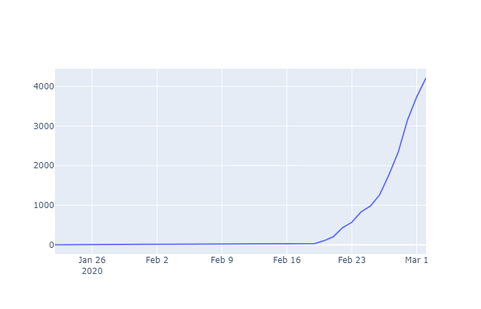
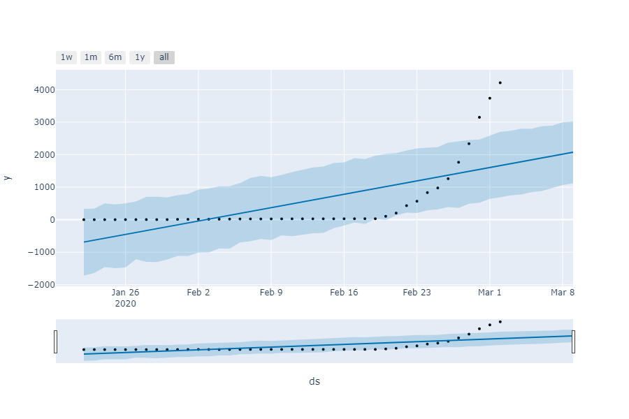
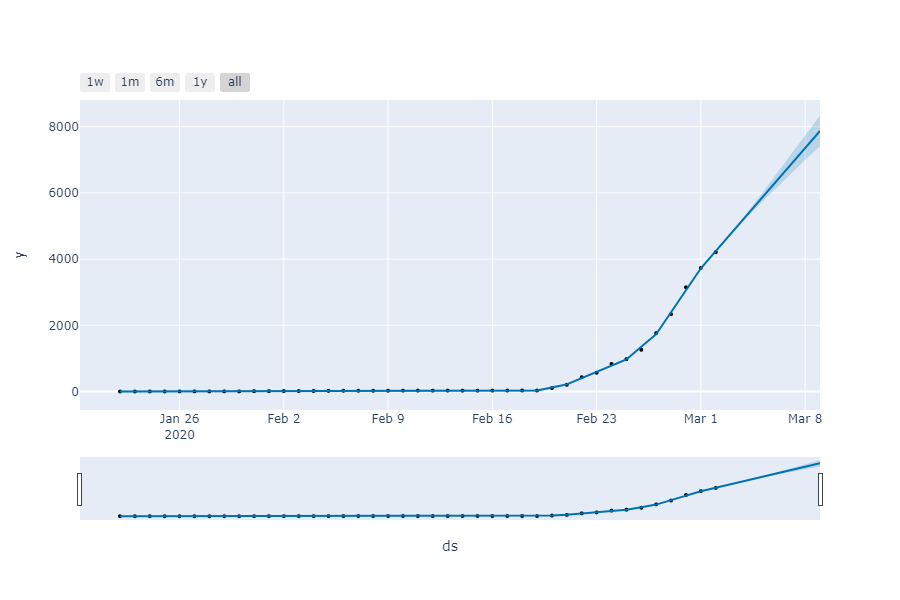
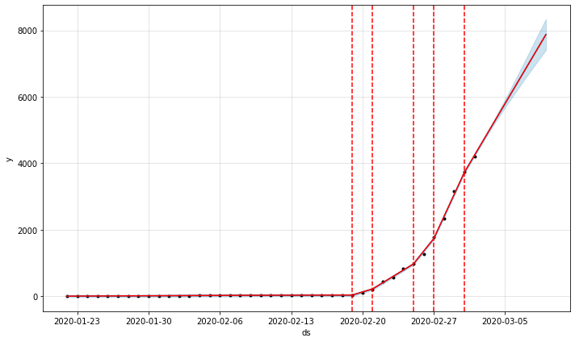

# 코로나 예측 모델

> pip install plotly
>
> pip install pystan
>
> conda install -c conda-forge fbprophet

```python
import pandas as pd
import plotly.graph_objs as go
import plotly.offline as py
from fbprophet import Prophet
from fbprophet.plot import plot_plotly, add_changepoints_to_plot
py.init_notebook_mode()
```

# Load Dataset

```python
df= pd.read_csv("time_series_19-covid-Confirmed.csv")
df.head()
```

|      | Province/State | Country/Region |      Lat |     Long | 1/22/20 | 1/23/20 | 1/24/20 | 1/25/20 | 1/26/20 | 1/27/20 |  ... | 2/12/20 | 2/13/20 | 2/14/20 | 2/15/20 | 2/16/20 | 2/17/20 | 2/18/20 | 2/19/20 | 2/20/20 | 2/21/20 |
| ---: | -------------: | -------------: | -------: | -------: | ------: | ------: | ------: | ------: | ------: | ------: | ---: | ------: | ------: | ------: | ------: | ------: | ------: | ------: | ------: | ------: | ------- |
|    0 |          Anhui | Mainland China | 31.82571 | 117.2264 |       1 |       9 |      15 |      39 |      60 |      70 |  ... |     889 |     910 |     934 |     950 |     962 |     973 |     982 |     986 |     987 | 988     |
|    1 |        Beijing | Mainland China | 40.18238 | 116.4142 |      14 |      22 |      36 |      41 |      68 |      80 |  ... |     352 |     366 |     372 |     375 |     380 |     381 |     387 |     393 |     395 | 396     |
|    2 |      Chongqing | Mainland China | 30.05718 | 107.8740 |       6 |       9 |      27 |      57 |      75 |     110 |  ... |     518 |     529 |     537 |     544 |     551 |     553 |     555 |     560 |     567 | 572     |
|    3 |         Fujian | Mainland China | 26.07783 | 117.9895 |       1 |       5 |      10 |      18 |      35 |      59 |  ... |     272 |     279 |     281 |     285 |     287 |     290 |     292 |     293 |     293 | 293     |
|    4 |          Gansu | Mainland China | 36.06110 | 103.8343 |       0 |       2 |       2 |       4 |       7 |      14 |  ... |      87 |      90 |      90 |      90 |      90 |      91 |      91 |      91 |      91 | 91      |

5 rows × 35 columns

# Filter

```python
df_korea = df[df['Country/Region']== 'South Korea']

df_korea.head()
```

|      | Province/State | Country/Region |     Lat |    Long | 1/22/20 | 1/23/20 | 1/24/20 | 1/25/20 | 1/26/20 | 1/27/20 |  ... | 2/12/20 | 2/13/20 | 2/14/20 | 2/15/20 | 2/16/20 | 2/17/20 | 2/18/20 | 2/19/20 | 2/20/20 | 2/21/20 |
| ---: | -------------: | -------------: | ------: | ------: | ------: | ------: | ------: | ------: | ------: | ------: | ---: | ------: | ------: | ------: | ------: | ------: | ------: | ------: | ------: | ------: | ------: |
|   33 |            NaN |    South Korea | 37.5665 | 126.978 |       1 |       1 |       2 |       2 |       3 |       4 |  ... |      28 |      28 |      28 |      28 |      29 |      30 |      31 |      31 |     104 |     204 |

1 rows × 35 columns

# Make it Simple

```python
df_korea= df_korea.T[4:]  #transpose
df_korea = df_korea.reset_index().rename(columns={'index':'date', 33:'confirmed'}) #

df_korea['date'] = pd.to_datetime(df_korea['date'])
df_korea.head()
```

|      |       date | confirmed |
| ---: | ---------: | --------: |
|    0 | 2020-01-22 |         1 |
|    1 | 2020-01-23 |         1 |
|    2 | 2020-01-24 |         2 |
|    3 | 2020-01-25 |         2 |
|    4 | 2020-01-26 |         3 |

# Add Recent Data

```python
df_korea = df_korea.append([
    {'date': pd.to_datetime('2020-02-22'), 'confirmed': 433},
    {'date': pd.to_datetime('2020-02-23'), 'confirmed': 568},
    {'date': pd.to_datetime('2020-02-24'), 'confirmed': 833},
    {'date': pd.to_datetime('2020-02-25'), 'confirmed': 977},
    {'date': pd.to_datetime('2020-02-26'), 'confirmed': 1261},
    {'date': pd.to_datetime('2020-02-27'), 'confirmed': 1766},
    {'date': pd.to_datetime('2020-02-28'), 'confirmed': 2337},
    {'date': pd.to_datetime('2020-02-29'), 'confirmed': 3150},
    {'date': pd.to_datetime('2020-03-01'), 'confirmed': 3736},
    {'date': pd.to_datetime('2020-03-02'), 'confirmed': 4212},
],  ignore_index=True)

df_korea.tail()
```

|      |       date | confirmed |
| :--- | ---------: | --------: |
| 36   | 2020-02-27 |      1766 |
| 37   | 2020-02-28 |      2337 |
| 38   | 2020-02-29 |      3150 |
| 39   | 2020-03-01 |      3736 |
| 40   | 2020-03-02 |      4212 |

# Plot

```python
fig = go.Figure()

fig.add_trace(
     go.Scatter(
            x=df_korea.date,
            y=df_korea.confirmed,
            name='Confirmed in Korea'
    )
)
```



# Facebook Prophet

```
df_prophet = df_korea.rename(columns={
    'date':'ds',
    'confirmed':'y'
})
df_prophet.head()

```

|      |         ds |    y |
| :--- | ---------: | ---: |
| 0    | 2020-01-22 |    1 |
| 1    | 2020-01-23 |    1 |
| 2    | 2020-01-24 |    2 |
| 3    | 2020-01-25 |    2 |
| 4    | 2020-01-26 |    3 |

# Create a Model

```python
m = Prophet(
yearly_seasonality=False,
weekly_seasonality=False,
daily_seasonality=True,
seasonality_mode='additive')    #계절 변동의 영향이 트렌드에 더해지는 형태로 나타날떄 사용

m.fit(df_prophet)  # 모델학습

future = m.make_future_dataframe(periods=7) # 예측할기간동안의 데이터 저장공간을 미리 확보

future.tail(7)
```

|      |         ds |
| :--- | ---------: |
| 41   | 2020-03-03 |
| 42   | 2020-03-04 |
| 43   | 2020-03-05 |
| 44   | 2020-03-06 |
| 45   | 2020-03-07 |
| 46   | 2020-03-08 |
| 47   | 2020-03-09 |

# Predict

```python
forecast = m.predict(future)
forecast[['ds', 'yhat', 'yhat_lower', 'yhat_upper']].tail(7)
# [날짜, 예측값, 오차를 고려한 예측 최소값, 오차를 고려한 예측 최대값]
```

|      |         ds |
| :--- | ---------: |
| 41   | 2020-03-03 |
| 42   | 2020-03-04 |
| 43   | 2020-03-05 |
| 44   | 2020-03-06 |
| 45   | 2020-03-07 |
| 46   | 2020-03-08 |
| 47   | 2020-03-09 |

# Plot Prediction

```python
fig = plot_plotly(m, forecast)
py.iplot(fig)
```



# Add changepoints to Make More Flexible

```python
m = Prophet(
    changepoint_prior_scale=0.2, # 값이 커질수록 모델을 유연하게 만듬
    changepoint_range=0.98,    #데이터 앞쪽 몇 퍼센트 부분안에서 변화점을 만들 것인지 설정
    yearly_seasonality=False,
    weekly_seasonality=False,
    daily_seasonality=True,
    seasonality_mode='additive')

m.fit(df_prophet)

future = m.make_future_dataframe(periods=7)
forecast = m.predict(future)

fig = plot_plotly(m, forecast)
py.iplot(fig)
```



# plot changepoints

```
fig = m.plot(forecast)
a = add_changepoints_to_plot(fig.gca(), m, forecast) # 그래프에 변화점을 추가
```




